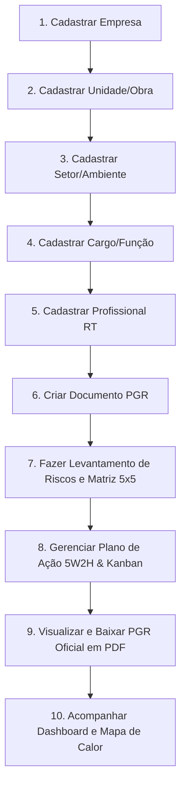

# 📋 GUIA E PLANO DE TESTES PASSO A PASSO - SISTEMA PGR (NR-01)

Este guia foi elaborado para você testar todas as funcionalidades do **Sistema PGR** do início ao fim, partindo de uma base totalmente zerada.

---

## 🚀 Como Acessar a Ferramenta

Abra seu navegador e acesse:
👉 **[http://localhost:3000/](http://localhost:3000/)**

*(Caso ainda haja algum dado em cache no seu navegador, clique no botão vermelho **"Zerar Dados"** no topo da tela para garantir a inicialização 100% limpa).*

---

## 📌 Roteiro de Testes Passo a Passo

---

### 🔹 ETAPA 1: Cadastrar a Empresa
1. No menu lateral, clique em **"Empresas / Clientes"**.
2. Clique no botão **"+ Cadastrar Empresa"**.
3. Preencha os campos de exemplo:
   - **Razão Social:** `Metalúrgica Brasil Sul Ltda`
   - **Nome Fantasia:** `Brasil Sul Industrial`
   - **CNPJ:** `11.222.333/0001-44`
   - **CNAE:** `25.39-0-01`
   - **Grau de Risco (NR-04):** `Grau 3`
   - **Representante Legal:** `João da Silva (Diretor Geral)`
   - **Total de Empregados:** `35`
   - **Cidade/UF:** `Curitiba / PR`
4. Clique em **"Cadastrar"**.
5. *Resultado esperado:* A empresa aparece na listagem com o badge "Ativa".

---

### 🔹 ETAPA 2: Cadastrar a Unidade / Estabelecimento
1. No menu lateral, clique em **"Unidades & Obras"**.
2. Clique em **"+ Cadastrar Unidade"**.
3. Preencha:
   - **Nome da Unidade:** `Fábrica Matriz Curitiba`
   - **Código:** `EST-001`
   - **Tipo:** `Matriz`
   - **Responsável Local:** `Eng. Carlos Souza`
   - **Trabalhadores:** `35`
   - **Cidade/UF:** `Curitiba / PR`
4. Clique em **"Cadastrar"**.
5. *Resultado esperado:* A unidade é vinculada à sua empresa.

---

### 🔹 ETAPA 3: Cadastrar Setores e Ambientes Físicos (NR-01.5.7.1)
1. No menu lateral, clique em **"Setores & Ambientes"**.
2. Clique em **"+ Cadastrar Setor"**.
3. Preencha:
   - **Nome do Setor:** `Setor de Usinagem e Solda`
   - **Descrição:** `Galpão de corte, usinagem em tornos e bancadas de soldagem metálica.`
   - **Piso:** `Concreto de alta resistência`
   - **Paredes:** `Alvenaria com biombos de proteção óptica`
   - **Ventilação:** `Mista` • **Iluminação:** `Mista`
4. Clique em **"Cadastrar"**.

---

### 🔹 ETAPA 4: Cadastrar Cargo e Função
1. No menu lateral, clique em **"Cargos & Funções"**.
2. Clique em **"+ Cadastrar Cargo"**.
3. Preencha:
   - **Setor:** Selecione `Setor de Usinagem e Solda`
   - **Cargo:** `Operador de Torno Mecânico`
   - **CBO:** `7212-15`
   - **Trabalhadores:** `6`
   - **Atividades Rotineiras:** `Operação de torno convencional, corte de tarugos de aço, medição dimensional com paquímetro.`
4. Clique em **"Cadastrar"**.

---

### 🔹 ETAPA 5: Cadastrar o Responsável Técnico (RT)
1. No menu lateral, clique em **"Profissionais Técnicos (RT)"**.
2. Clique em **"+ Cadastrar Profissional"**.
3. Preencha:
   - **Nome:** `Eng. Roberto Alencar Ribeiro`
   - **Função:** `Engenheiro de Seg. do Trabalho`
   - **Conselho:** `CREA/PR`
   - **Número de Registro:** `123456-D`
   - **ART/RRT:** `ART-2026-009988-PR`
   - **E-mail:** `roberto.eng@sst.com.br`
4. Clique em **"Cadastrar"**.

---

### 🔹 ETAPA 6: Criar o Documento Base do PGR (NR-01.5.3)
1. No menu lateral, clique em **"Documentos do PGR"**.
2. Clique em **"+ Criar Nova Versão do PGR"**.
3. Verifique os dados pré-preenchidos:
   - **Código:** `PGR-2026-001`
   - **Título:** `Programa de Gerenciamento de Riscos - Fábrica Matriz 2026`
   - **Status:** `Aprovado / Vigente Oficial`
   - **Responsável Técnico:** Selecione o `Eng. Roberto Alencar`
4. Clique em **"Criar Documento"**.

---

### 🔹 ETAPA 7: Elaborar o Inventário de Riscos com a Matriz 5x5 (NR-01.5.7)
1. No menu lateral, clique em **"Inventário de Riscos"**.
2. Clique em **"+ Adicionar Risco"**.
3. **Preenchimento Guiado:**
   - **Setor:** `Setor de Usinagem e Solda`
   - **Cargo:** `Operador de Torno Mecânico`
   - **População Exposta:** `6 trabalhadores`
   - **Importar do Catálogo:** Escolha `[01.01.001] Ruído Contínuo ou Intermitente` *(Os campos de perigo, fonte e danos serão preenchidos automaticamente)*.
   - **Interaja na Matriz de Risco 5x5:**
     - Clique na célula **Severidade 3 (Grave)** e **Probabilidade 4 (Frequente)**.
     - *Observe:* O Score vai para `12` e a classificação muda instantaneamente para **SUBSTANCIAL (Alto)** com recomendação de controle prioritário em 30 dias.
   - **Medidas de Controle Existentes:**
     - Adicione um EPC: `Enclausuramento parcial dos tornos`
     - Adicione um EPI com CA: `Protetor auditivo tipo concha` (CA: `14235`)
   - **Avaliação Quantitativa (Opcional):** Ative o botão e insira: Agente: `Ruído NEN`, Valor: `86.5 dB(A)`, Nível de Ação: `80.0`, Limite: `85.0`.
   - Mantenha marcada a opção **"Gerar Item no Plano de Ação (5W2H)?"**.
4. Clique em **"Adicionar ao Inventário"**.
5. *Resultado esperado:* O risco aparece na tabela. Clique no botão de seta para expandir e ver os detalhes completos de EPC, EPI com CA e medições ambientais!

---

### 🔹 ETAPA 8: Gerenciar o Plano de Ação 5W2H (NR-01.5.5)
1. No menu lateral, clique em **"Plano de Ação (5W2H)"**.
2. Veja que a ação gerada pelo inventário já está listada.
3. Teste os recursos:
   - Clique no botão **"Kanban"** para alternar para o quadro ágil.
   - Clique no botão **"Avançar →"** para mover o card de *Não Iniciada* para *Em Andamento* e depois para *Concluída*.
   - Clique no card para abrir o modal, marcar a **"Verificação de Eficácia"** e digitar o parecer técnico pós-inspeção.

---

### 🔹 ETAPA 9: Emitir e Baixar o Documento PGR em PDF
1. No menu lateral, clique em **"Documentos do PGR"**.
2. Clique no botão **"Visualizar"**:
   - Uma tela formal em formato de documento técnico será renderizada contendo: Capa oficial, Dados do Empregador, Metodologia da NR-01, Caracterização dos Setores e Cargos, Tabela Oficial do Inventário de Riscos, Cronograma 5W2H e Bloco de Assinaturas.
3. Clique no botão verde **"Baixar PDF Oficial"**:
   - Um arquivo PDF profissional diagramado será gerado e baixado no seu computador!

---

### 🔹 ETAPA 10: Verificar o Dashboard Executivo
1. No menu lateral, clique em **"Visão Geral (Dashboard)"**.
2. Observe que:
   - Os KPIs foram atualizados com os dados reais cadastrados.
   - O **Mapa de Calor 5x5** destaca a célula do risco cadastrado.
   - O gráfico de grupos de risco reflete os perigos cadastrados.
   - O percentual de conclusão do Plano de Ação é recalculado em tempo real.

---

🎉 **Pronto! Com este roteiro, você testou o fluxo completo de atendimento à NR-01 do Sistema PGR!**
